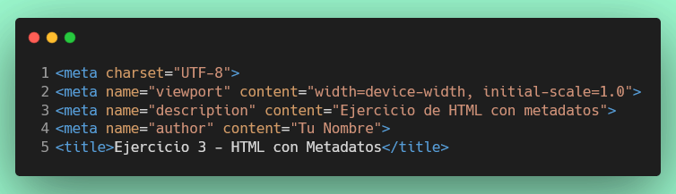

# Ejercicio 6: Crear un documento HTML con metadatos

## Objetivo
Crear un archivo HTML básico y agregar varias etiquetas de metadato en la sección `<head>`.

## Instrucciones

1. Crear la carpeta `src/metadatos`, si no existe, crea un archivo llamado `index.html` dentro de esta carpeta.
2. Dentro de `index.html`, escribe la estructura básica de un documento HTML.
3. Agrega al menos las siguientes etiquetas de metadato dentro de la sección `<head>`:



4. Agregar la meta etiqueta para definir soporte para el lenguaje español.
5. Agregar la meta etiqueta para definir el autor del documento como "Tu Nombre".
6. Agregar la meta etiqueta para definir la descripción del documento como "Este es un documento HTML de ejemplo con metadatos".
7. Agregar la meta etiqueta para definir las palabras clave del documento como "HTML, metadatos, ejemplo".
8. Agregar la meta etiqueta para definir la vista para dispositivos móviles con el contenido `width=device-width, initial-scale=1.0`.
9. Agregar la etiqueta `<title>` con el texto "Documento HTML con Metadatos".
10. Asegúrate de que el archivo HTML esté correctamente estructurado y que todas las etiquetas estén cerradas adecuadamente.

## Estructura final esperada

```
src/
└── metadatos/
    └── index.html
```

## Verificación
Una vez que hayas completado el ejercicio ejecuta:
``` npm
  npm test ejercicio/6
```
Si pasa todos los test, haz commit de tus cambios y súbelos a tu repositorio de GitHub.  

Una vez que hayas completado el ejercicio, haz commit de tus cambios y súbelos a tu repositorio de GitHub.

¡Buena suerte y diviértete programando!
