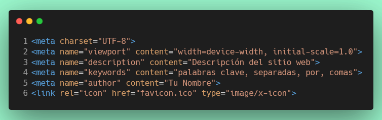

# Ejercicio 7: Crear un documento HTML con metadatos y favicon

## Objetivos
Crear un archivo HTML básico y agregar varias etiquetas de metadato en la sección `<head>`. Agregar un favicon al documento HTML.

## Requisitos

1. Debe existir una carpeta `docs/metadatos`, del ejercicio anterior, y un archivo llamado `index.html` dentro de esta carpeta.
2. El archivo `index.html`, debe tener la estructura básica de un documento HTML.
3. Con las etiquetas de metadato dentro de la sección `<head>`:



4. Asegúrate de que el archivo HTML esté correctamente estructurado y que todas las etiquetas estén cerradas adecuadamente.
5. Debes incluir un favicon en el documento HTML. El favicon debe ser un archivo llamado `favicon.ico` y debe estar en la misma carpeta que el archivo `index.html`.

## Instrucciones
1. Crea el archivo `servicios.html` dentro de la carpeta `docs/metadatos
2. Abre el archivo `servicios.html` en tu editor de código. 
3. Agrega la estructura básica de un documento HTML.
4. Dentro de la sección `<head>`, agrega las siguientes etiquetas de metadato:
5. Asegúrate de que el favicon `favicon.ico` esté en la misma carpeta que el archivo `servicios.html`. 

*Si no tienes un favicon, puedes crear uno simple o descargar uno de internet.*

## Estructura final esperada

```
docs/
└── metadatos/
    └── index.html
    └── favicon.ico
    └── servicios.html
```

## Verificación

Para verificar que tu archivo `servicios.html` cumple con los requisitos, debes asegurarte de que:

   1. Estructura HTML básica completa
   2. Título con contenido significativo
   3. Metaetiqueta charset UTF-8
   4. Metaetiqueta viewport con configuración responsive
   5. Metaetiqueta description con contenido válido
   6. Metaetiqueta keywords con comas separando las palabras
   7. Metaetiqueta author con nombre válido
   8. Enlace al favicon con los atributos correctos

## Validaciones de calidad:

   1. Todas las metaetiquetas deben estar en el <head>
   2. No debe haber metaetiquetas duplicadas
   3. El contenido de las metaetiquetas debe ser válido y significativo
   4. El documento debe estar bien formado

## Compatibilidad con ejercicio anterior:

   1. Verifica que el index.html del ejercicio 6 sigue funcionando.
   2.  Mantiene los metadatos del ejercicio anterior.
``` npm
  npm test ejercicio/6
```

Una vez que hayas completado el ejercicio ejecuta:
``` npm
  npm test ejercicio/7
```
Si pasa todos los test, haz commit de tus cambios y súbelos a tu repositorio de GitHub.  

Una vez que hayas completado el ejercicio, haz commit de tus cambios y súbelos a tu repositorio de GitHub.

¡Buena suerte y diviértete programando!
